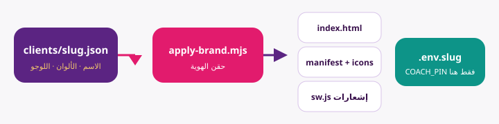
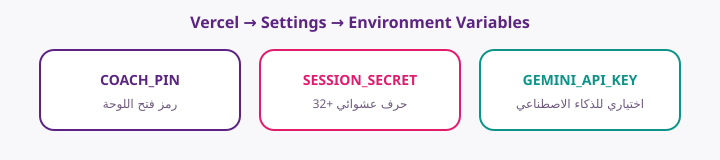
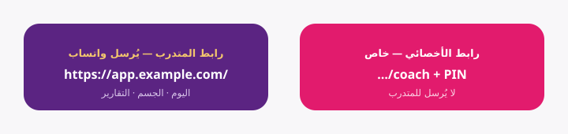
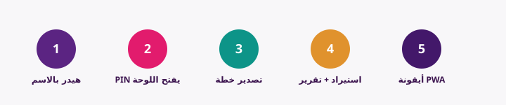

# قائمة تسليم نسخة عيادة (Checklist)

استخدم هذه القائمة مع كل عميل جديد. لا تتخطّى بند الأمان.

## نظرة سريعة



```
clients/<slug>.json  →  apply-brand  →  index.html + manifest (logoPath) + sw.js
                     →  .env.<slug>  (COACH_PIN فقط هنا — ليس في الواجهة)
```

---

## أ) قبل البناء

- [ ] نسخ `clients/_template.json` → `clients/<slug>.json`
- [ ] تعبئة: appName, shortName, clinicName, doctorName
- [ ] الجنس النحوي: specialistTitle / specialistShort / specialistTo
- [ ] themeColor + accentColor + backgroundColor
- [ ] whatsapp بصيغة دولية (مثال `2010xxxxxxxx`)
- [ ] شعار مربع PNG 512×512 في `public/brands/<slug>.png`
- [ ] `logoPath`: `"/brands/<slug>.png"`
- [ ] **لا تكتب PIN داخل JSON** — لا يوجد حقل `defaultAdminPin`

## ب) البناء

```bash
node scripts/new-client.mjs <slug> --pin=48291 --build
```

لو حذفت `--pin` يتولد رقم عشوائي ويُطبع في الطرفية.

- [ ] نجاح الأمر بدون أخطاء
- [ ] وجود `.env.<slug>` محليًا (لا يُرفع Git)
- [ ] `src/config/brand.json` يخص هذا العميل **بدون أي PIN**
- [ ] `public/manifest.json` → `icons[].src` = نفس `logoPath`
- [ ] `index.html` → `rel="icon"` و `apple-touch-icon` = `logoPath`
- [ ] `public/sw.js` → `BRAND_LOGO_PATH` و`BRAND_SHORT_NAME` بدون اسم عيادة قديمة

## ج) النشر (Vercel)



- [ ] مشروع/دومين خاص بالعيادة
- [ ] Environment Variables (Production):
  - [ ] `COACH_PIN`
  - [ ] `SESSION_SECRET` (32+ حرف)
  - [ ] `GEMINI_API_KEY` (إن لزم)
- [ ] Deploy ناجح
- [ ] اختبار `/` و `/coach`

## د) التسليم للأخصائي (قناة خاصة فقط)



- [ ] رابط واجهة المتدرب (يُرسل واتساب)
- [ ] رابط `/coach` + PIN مرة واحدة (ليس مع المتدربين)
- [ ] تنبيه: لا تشارك PIN في جروب
- [ ] شرح دقيقة: تصدير خطة → استيراد عند المتدرب → تقرير واتساب

## هـ) اختبار قبول قبل التسليم



- [ ] 1 — الهيدر يظهر اسم العيادة الجديدة (ليس اسم عيادة سابقة)
- [ ] 2 — PIN الصحيح يفتح اللوحة، الغلط يُرفض
- [ ] 3 — تصدير خطة واتساب من اللوحة
- [ ] 4 — استيراد عند المتدرب + تقرير اليوم يفتح رقم العيادة إن وُجد
- [ ] 5 — تثبيت PWA: الأيقونة = شعار العميل (قد تحتاج إعادة تثبيت الاختصار)
- [ ] إشعار تجريبي يظهر عنوان `تذكير <shortName>`
- [ ] ألوان الأزرار/الهيدر تطابق themeColor و accentColor
- [ ] قطع النت بعد أول دخول ناجح: نفس PIN يفتح اللوحة (وضع أوفلاين بدون Gemini)

## و) ما لا تفعله

- لا ترسل `.env` على واتساب جماعي
- لا ترفع `.env.*` على GitHub عام
- لا تكتب PIN داخل `brand.json` أو `clients/*.json`
- لا تستخدم نفس `COACH_PIN` لكل العيادات
- لا تعتمد على `plan.adminPin` لفتح اللوحة
